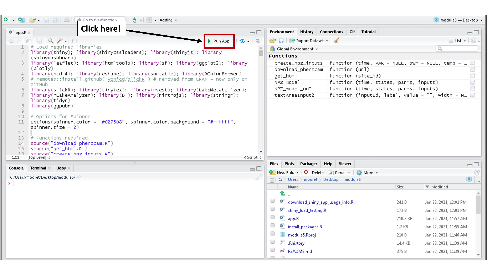

<!-- -->
# [Macrosystems EDDIE](https://serc.carleton.edu/eddie/macrosystems/index.html)
## Module 6: Understanding Uncertainty in Ecological Forecasts
[](https://macrosystemseddie.shinyapps.io/module6/)
[](https://mybinder.org/v2/gh/MacrosystemsEDDIE/module6/main?urlpath=shiny/app/)
### Summary
Here is the code for running the Macrosystems EDDIE Module 6: _Understanding Uncertainty in Ecological Forecasts_. Below are instructions on how to access the Shiny app *via* a web browser and also a detailed guide below for launching the R Shiny App locally on your own computer. For more details about teaching this module please visit our [website](https://serc.carleton.edu/eddie/teaching_materials/modules/module5.html).

## Accessing the Shiny App _via_ a web browser
The Shiny app for this module can be accessed through any internet browser either on [shinyapps.io](https://macrosystemseddie.shinyapps.io/module6/) or [mybinder.org](https://mybinder.org/v2/gh/MacrosystemsEDDIE/module6/main?urlpath=shiny/app/).
When launching first it will take a while for the Shiny app to boot up. If you are using this in a large class (>20 users at the same time), we would recommend splitting the group into two and using **both** [shinyapps.io](https://macrosystemseddie.shinyapps.io/module5/) and [mybinder.org](https://mybinder.org/v2/gh/MacrosystemsEDDIE/module5/main?urlpath=shiny/app/).

##  Running the Shiny App on your computer
### Pre-requisites
1. Latest version of [R](https://cran.r-project.org/) installed (currently R 4.0.3 as of 2021-01-22).  
2. [RStudio](https://rstudio.com/products/rstudio/download/) installed (preferably >1.3).  

### Step 1: Download this repository
There are two options:  
1. Download the repository as a .zip file. (Easiest option).  
    a.  Click the green "Code" button on this page and select "Download ZIP".  
    b.  Unzip this file on your computer.  
2. Clone this repository into RStudio.  
		a.  Open RStudio.  
		b.  Click "File > New Project...".  
		c.  In the "Create Project dialog select "Version Control: Checkout a project from a version control repository".  
		d. Select "Git: Clone a project from a Git repository.  
		e. In the "Repository URL:" option input the URL to this repository, select where to save the project directory.  
		f. Click "Create Project".  
		g. You will then have a project with all the files from this repository.  
		
### Step 2: Install required R packages
1. The list of required of packages is detailed in the `install.R` script in this repository. Open and run this script to install the necessary packages.  
  Watch out for errors in package installation. Most can be avoided using the most up-to-date version of R (4.0.3 as of 2021-01-22).  
  Updating of current R packages on your system is recommended.

### Step 3: Launch Shiny App
1. Open the script `app/server.R` in your console.  It is found in the `app` directory
2. Click the "Run App" button in the Script (indicated below).  
3. This will launch the Shiny App in your default web browser or in a new RStudio window. The Shiny App is run from RStudio so you will need to keep RStudio running in the background.  
<!-- -->	

## Quickstart option
Here is an alternative way to quickly launch the Shiny app in less than a minute, but can be prone to package installation errors if your packages have not been updated recently.
```
# Step 1. Install required R packages
source("https://raw.githubusercontent.com/MacrosystemsEDDIE/module6/main/install.R")

# Step 2. Launch Shiny app
shiny::runGitHub("module6", "MacrosystemsEDDIE", ref = "main", subdir = "app")
```

## Questions & Feedback
If you have any questions, comments or feedback related to these materials you can send an email to [macrosystemseddie@gmail.com]().
 
